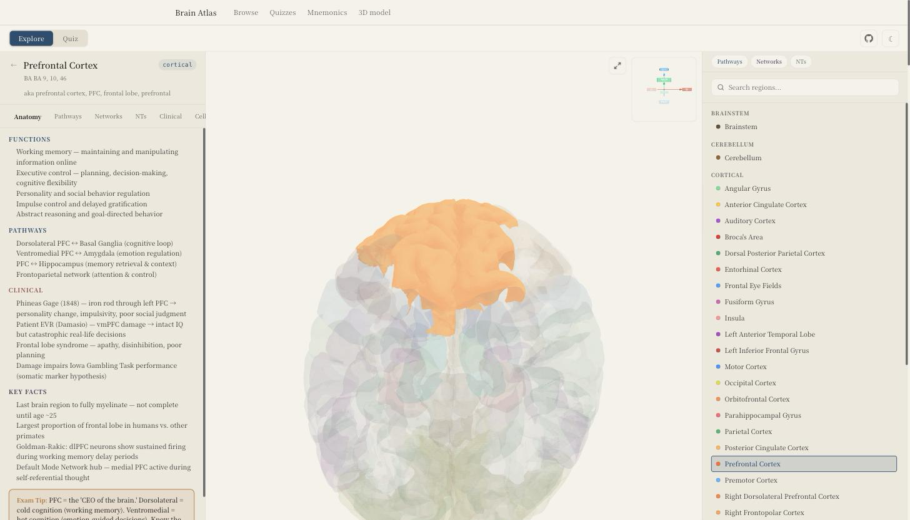
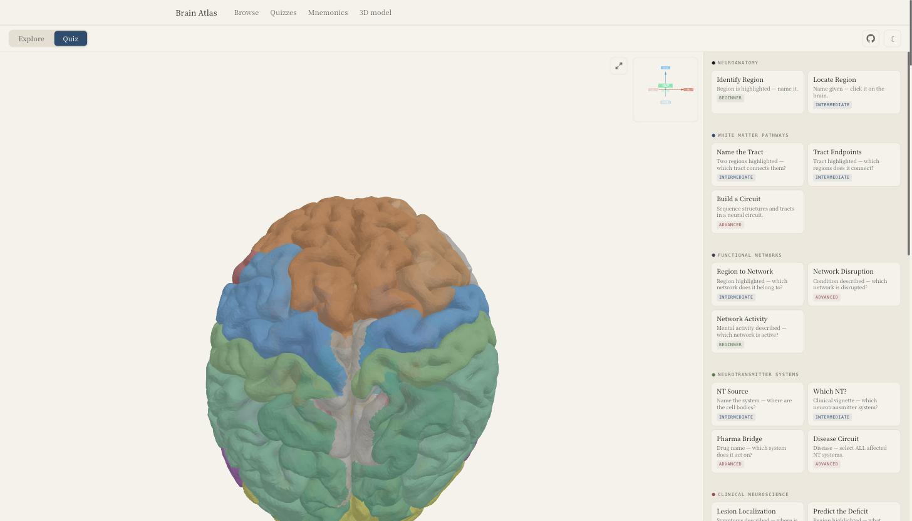
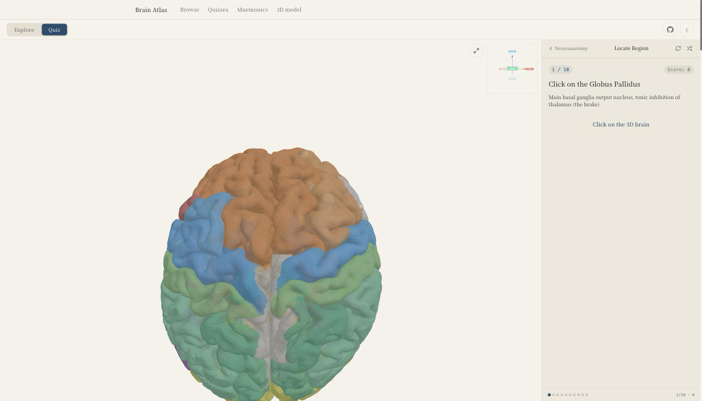
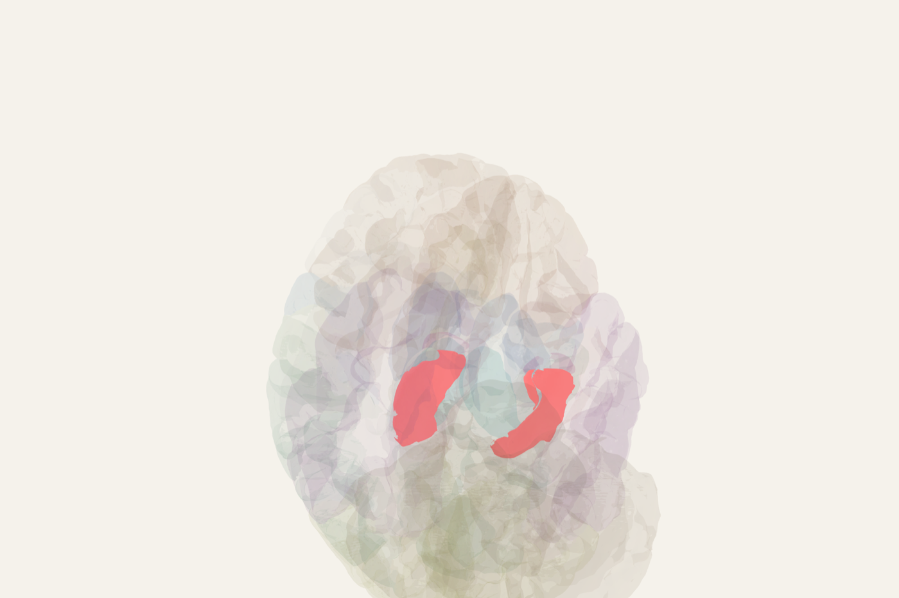
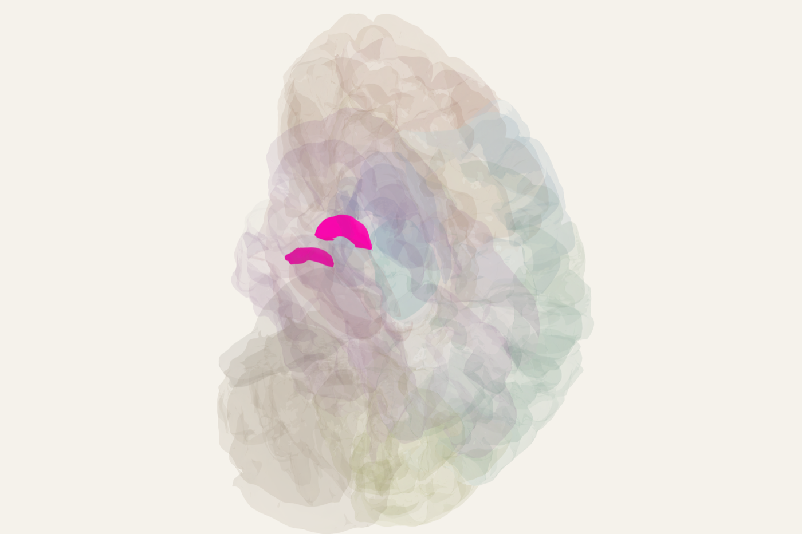

# Brain Atlas

**Learn neuroanatomy on a real 3D brain instead of a flat labelled diagram.**

[](https://brainquiz.study)
[](https://nextjs.org)
[](https://react.dev)
[](https://threejs.org)
[](LICENSE)

Rotate and click a WebGL brain built from Desikan-Killiany atlas meshes to explore
49 regions, then test yourself with quizzes generated across 9 neuroscience
dimensions — from naming lobes and cranial nerves to localising a stroke lesion or
picking the disrupted functional network.

No login, no accounts, no backend. Everything runs in the browser and progress
lives in `localStorage`.

**→ [brainquiz.study](https://brainquiz.study)**



## What's in it

| | |
|---|---|
| **49 regions** | Cortical, subcortical, brainstem and cerebellar, each with functions, connections, clinical relevance and exam notes |
| **102 meshes** | Real Desikan-Killiany pial surfaces (70 cortical + 32 subcortical), raycast for click-to-select |
| **9 dimensions** | Anatomy · pathways · networks · neurotransmitters · clinical · developmental · neuroimaging · cellular · cranial nerves |
| **4 answer formats** | Multiple choice, **click-on-brain**, ordering, multi-select |
| **~60 static pages** | Quiz landings, per-region guides, mnemonics and comparisons, all prerendered with JSON-LD |

### Questions are generated, not authored

There is no question bank. Each dimension has a generator in
`lib/quiz/generators/` that composes questions from the region and pathway data at
runtime, so the same quiz type produces different questions each run and new
content follows automatically from new data.

Quiz state is a pure reducer (`lib/quiz/quiz-engine.ts`). An unfinished session
resumes from `localStorage` for 7 days; the last 20 completed runs are kept for
history. Nothing is sent to a server — there isn't one.





### Beyond static regions

The viewer is not just a mesh picker. `lib/three/` adds overlays that animate on
top of the anatomy, managed by `lib/overlay-manager.ts` (mutual exclusion by
group, cortex opaque / x-ray / hidden):

- **White matter tracts** — CatmullRom tube meshes with a travelling emissive pulse
- **Neurotransmitter flows** — instanced particles animating along pathways
- **Functional networks** — member regions recoloured, dashed inter-node links
- **Vascular territories** — regions recoloured by MCA / ACA / PCA supply
- **`.glb` export** — dumps the current scene for PowerPoint's *Insert → 3D Models*

<p align="center">
  
  
</p>

## Running it

```bash
npm install
npm run dev        # http://localhost:3000
npm run build      # also runs the SEO + question validators
```

No `.env` is required — every variable falls back. Copy `.env.example` to
`.env.local` only to point at a custom domain or enable
[Umami](https://umami.is) analytics (cookieless, so there's no consent banner;
without both vars set the script is never injected).

A few things worth knowing before you dig in:

- `public/brain-meshes/` is **31 MB of `.obj` committed to the repo**, and the
  viewer loads all 102 meshes rather than fetching per region. First paint of the
  3D view is heavy by design; the landing pages defer mounting behind a button.
- The viewer is `dynamic(..., { ssr: false })` and needs WebGL. It will never
  render server-side.
- shadcn here is style **`base-nova` / `@base-ui/react`**, not Radix — components
  take a `render={...}` prop instead of Radix's `asChild`.
- All dynamic routes use `generateStaticParams` with `dynamicParams = false`, so
  an unknown slug 404s rather than rendering empty.

## Tests

There are no unit tests. Correctness is enforced at build time instead — both
validators fail `next build`:

- `lib/seo/pages/index.ts` — titles ≤ 60 chars, descriptions 120–160, no
  self-links, no dangling related slugs.
- `lib/quiz/validate-questions.ts` — validates generated question text.

⚠️ The question validator only runs because `app/quiz/[slug]/page.tsx` imports it
and that route prerenders. Moving that import silently disables the check.

## Content tooling

`app/render/` exposes `/render?region=<slug>` — an internal, `noindex` route that
renders a single highlighted region and sets `data-shot-ready` once the scene has
settled, so a headless driver knows the frame is final. The region images in this
README came out of it.

`docs/seo/` holds the keyword research behind the static pages, and
`docs/seo/sources.md` is the editorial rule: **every clinical claim must trace to
StatPearls.** `tools/kw.py` is a small Apify-backed keyword script with a hard
spend cap.

## Licence

Code is MIT — see [LICENSE](LICENSE). Asset terms are in [NOTICE](NOTICE).

The 3D meshes in `public/brain-meshes/` are **not** mine and are **not** MIT. They
derive from ["Brain for Blender"](https://brainder.org/) and stay under
**CC BY-SA 3.0**; redistributing them carries the same attribution and
share-alike terms.
